<!--
═══════════════════════════════════════════════════════════════════════════
 harisx404 / harisx404  —  GITHUB PROFILE README
 Maintenance guide (this comment block is invisible on the rendered profile)
═══════════════════════════════════════════════════════════════════════════

 STRUCTURE
   1. Header (ASCII logo + typing tagline + counters)
   2. whoami (terminal-style intro)
   3. Achievements
   4. Current Focus
   5. Tech Stack
   6. Repository Map (Major Projects + Skill Portfolios)
   7. GitHub Analytics
   8. Learning Roadmap (Mermaid diagram)
   9. Engineering Philosophy
  10. Connect

 HOW TO EXTEND THIS FILE
   - Blocks wrapped in HTML comments like this one are TEMPLATES.
     They are invisible on your profile until you delete the
     <!-- and --> around them.
   - When you create a new MAJOR project repo  -> copy the template
     row in "Major Projects" and fill it in.
   - When you create a new SKILL PORTFOLIO repo (hub repo) -> find it
     in the "Skill Portfolios" table and turn the plain repo name
     into a markdown link (instructions are in that section).
   - When you learn a new tool -> add its badge/icon to the relevant
     row in "Tech Stack". Commented rows are ready-made for the tools
     on your roadmap (n8n, Solidity, AWS, etc.).
   - Optional "special effect" widgets (Snake animation, WakaTime,
     capsule banners, alternate stat themes) are documented and
     commented out in section 7 — enable any you like.
═══════════════════════════════════════════════════════════════════════════
-->

<div align="center">

```
 ██╗  ██╗ █████╗ ██████╗ ██╗███████╗██╗  ██╗██╗  ██╗ ██████╗ ██╗  ██╗
 ██║  ██║██╔══██╗██╔══██╗██║██╔════╝╚██╗██╔╝██║  ██║██╔═████╗██║  ██║
 ███████║███████║██████╔╝██║███████╗ ╚███╔╝ ███████║██║██╔██║███████║
 ██╔══██║██╔══██║██╔══██╗██║╚════██║ ██╔██╗ ╚════██║████╔╝██║╚════██║
 ██║  ██║██║  ██║██║  ██║██║███████║██╔╝ ██╗      ██║╚██████╔╝     ██║
 ╚═╝  ╚═╝╚═╝  ╚═╝╚═╝  ╚═╝╚═╝╚══════╝╚═╝  ╚═╝     ╚═╝ ╚═════╝      ╚═╝
```

### `root@harisx404:~$ _`


**Full-Stack MERN Developer · Cybersecurity Professional · Top 15% NSCT Nationwide**
**BSIT Graduate (2022–2026) · University of Malakand, Pakistan**

<br/>


</div>

---

## 👨‍💻 whoami

```bash
$ whoami
Muhammad Haris (harisx404)
BSIT Graduate (2022–2026) · University of Malakand, Pakistan

$ cat current_focus.txt
> Engineering MedicaLink HMS — an enterprise Hospital Management SaaS
> Strengthening cybersecurity through CTF practice & hands-on labs
> Applying network security fundamentals from a professional certification
> Exploring AI automation, AI engineering & blockchain (KPITB program)

$ status --check
[✓] Open to   : Internships · Full-time roles · Freelance projects
[✓] Interests : Cybersecurity · Full-Stack Development · SOC Operations
[✓] Approach  : Security-first engineering — build it, then break it,
                then build it better
```

---

## 🏅 Achievements

| Achievement | Detail |
|:---:|---|
| 🎓 **Academic** | A+ Grade — Bachelor of Science in Information Technology (2022–2026) |
| 🥇 **National Rank** | Top 15% (84.6th percentile) — National Skill Competency Test, HEC/MoITT · 33,000+ candidates |
| 🔒 **Cybersecurity** | 96% score in Cybersecurity coursework · Active CTF practitioner (TryHackMe, HackTheBox, OverTheWire) |
| 🛡️ **SOC Internship** | SOC Analyst Intern · Tech Hierarchy (Mar 2026) · Wazuh SIEM · Log Analysis · Network Segmentation |
| 📡 **Networking** | Master Computer Networking Certificate — Scaler |
| ⛓️ **Blockchain** | Enrolled in the KPITB Blockchain Program — University of Malakand |

<!-- TEMPLATE — copy this row for each new certification or award, then uncomment
| 🏆 **[Achievement Title]** | [One-line detail — issuer, date, what it validates] |
-->

---

## 🎯 Current Focus

> 🏗️ **Actively building:** [MedicaLink HMS](https://github.com/harisx404/MedicaLink-HMS) — an enterprise-grade Hospital Management SaaS (TypeScript · MERN · Turborepo · WebSockets · multi-tenant architecture)

- 🌐 **Full-Stack Development** — daily commits on MedicaLink HMS, applying production-grade architecture and security patterns
- 🛡️ **Cybersecurity** — solving CTF rooms on TryHackMe, HackTheBox & OverTheWire, building toward SOC and AppSec roles
- 📡 **Network Security** — applying OSI/TCP-IP fundamentals from my networking certification to real-world defense design
- ⚡ **AI & Automation** — early exploration of n8n workflows and AI-assisted development pipelines
- ⛓️ **Blockchain & Web3** — working through the KPITB Blockchain Program to understand decentralized systems and smart contract security

---

## 🛠️ Tech Stack

**Languages**


**Frontend**


**Backend & Database**


**Tools & Platforms**


**Cybersecurity & Networking**


<!-- 🌱 CURRENTLY EXPLORING — keep this row honest; these are LEARNING, not mastered yet
**Currently Exploring**


-->

<!-- ROADMAP ADDITIONS — uncomment and append icons as each skill becomes active
**AI Engineering & Automation**


**Cloud & Cloud Security**


**Blockchain & Web3**

-->

---

## 🗂️ Repository Map

### 🚀 Major Projects

Flagship, individually deployed projects — each has its own repository, full documentation, and security architecture.

| Status | Project | Tech Stack | Description |
|:---:|---|---|---|
| 🟢 Active | [MedicaLink HMS](https://github.com/harisx404/MedicaLink-HMS) | TypeScript · MERN · Turborepo · WebSockets | Enterprise Hospital Management SaaS — multi-tenant, real-time, secure |
| ✅ Deployed | [TourMate Malakand — Frontend](https://github.com/harisx404/tourmate_malakand_frontend) | React.js · Mapbox GL JS · Vite | Full-Stack MERN tourism platform — Final Year Project |
| ✅ Deployed | [TourMate Malakand — Backend](https://github.com/harisx404/tourmate_malakand_backend) | Node.js · Express.js · MongoDB | Secure REST API — JWT, RBAC, OWASP mitigations, 99% cache optimization |

<!-- TEMPLATE — copy this row for each new major/flagship project, fill in, then uncomment
| 🟢 Active | [Project Name](https://github.com/harisx404/repo-name) | Tech · Stack · Here | One clear sentence — what it does and why it matters |
-->

### 📚 Skill Portfolios

Each skill area below has (or will have) a dedicated **hub repository** — a curated, organized collection of smaller projects, labs, scripts, and learning exercises for that domain. Flagship projects above remain in their own repos and are linked from the relevant hub too.

| Domain | Repository | Status | What's Inside |
|---|---|:---:|---|
| 🌐 Full-Stack Web Development | `web-dev-projects` | 🔜 Planned | Practice apps, UI component experiments, mini full-stack builds (flagship apps like MedicaLink HMS & TourMate Malakand stay in their own repos) |
| 🛡️ Cybersecurity | `cybersecurity-portfolio` | 🔜 Planned | TryHackMe / HackTheBox / OverTheWire writeups, network security labs (Packet Tracer), security tooling scripts |
| 🤖 AI Engineering | `ai-engineering-projects` | 🔜 Planned | LLM-powered apps, RAG pipelines, AI agent experiments |
| ⚡ AI Automation | `ai-automation-projects` | 🔜 Planned | n8n workflows, automation scripts, AI-assisted productivity tooling |
| ⛓️ Blockchain & Web3 | `blockchain-web3-projects` | 🔜 Planned | KPITB coursework, smart contracts, DApp experiments |

<!--
ACTIVATION INSTRUCTIONS — once you create a hub repo above, replace its
plain `repo-name` cell with a real link and update the status, e.g.:

| 🛡️ Cybersecurity | [cybersecurity-portfolio](https://github.com/harisx404/cybersecurity-portfolio) | 🟢 Active | TryHackMe / HackTheBox / OverTheWire writeups, network security labs, security tooling |

Update the Status column as each portfolio matures:
  🔜 Planned   → repo doesn't exist yet
  🟡 Started   → repo created, a few entries inside
  🟢 Active    → regularly updated with new entries
-->

---

## 📊 GitHub Analytics

<div align="center">


</div>

<!--
═══════════════════ OPTIONAL ANALYTICS WIDGETS ═══════════════════
Everything below is OFF by default. Uncomment anything you want to
try, see how it looks on your profile, and keep or remove it.

──────────────────────────────────────────────────────────────────
OPTION A — Profile Summary Cards (alternate stat layout/themes)
A different visual style than the cards above — pick ONE set if you
prefer this look instead of (not in addition to) the cards above.

<div align="center">
  
  
  
  
</div>

──────────────────────────────────────────────────────────────────
OPTION B — Contribution Snake (animated, eats your contribution graph)
Requires a one-time setup: add the GitHub Action from
https://github.com/Platane/snk to this repo (harisx404/harisx404),
which generates the SVG below automatically every day via a
scheduled workflow.

<div align="center">
  
</div>

──────────────────────────────────────────────────────────────────
OPTION C — WakaTime Coding Activity
Requires a free account at wakatime.com + their IDE/VS Code extension.
After a week of tracked coding time, replace USER_ID with yours.

<div align="center">
  
</div>

──────────────────────────────────────────────────────────────────
OPTION D — Capsule Banners (decorative wave header/footer)
A subtle animated gradient wave — purely visual flair. If you want
ONE special-effect element and nothing else, this is the lightest.
Place the HEADER version right after the opening <div align="center">
at the very top of this file, and the FOOTER version at the very
bottom of the file.

HEADER:


FOOTER:


──────────────────────────────────────────────────────────────────
OPTION E — Alternate Color Themes for the Stats Cards Above
Same widgets, different look — swap the theme= and color params if
you want to try a different palette without changing layout:

  Dracula:   theme=dracula
  Tokyo Night: theme=tokyonight
  Radical:   theme=radical
  Synthwave: theme=synthwave

Example:

═══════════════════════════════════════════════════════════════════
-->

---

## 🗺️ Learning Roadmap

```mermaid
graph LR
    A[🌐 Web Development] --> B[🛡️ Cybersecurity]
    B --> C[⚡ AI Automation]
    C --> D[🤖 AI Engineering]
    D --> E[🔒 AI Security]
    E --> F[☁️ Cloud & Cloud Security]
    F --> G[⛓️ Blockchain / Web3]

    style A fill:#00ff41,stroke:#080808,stroke-width:2px,color:#080808
    style B fill:#ff4455,stroke:#080808,stroke-width:3px,color:#ffffff
    style C fill:#ffb800,stroke:#080808,stroke-width:2px,color:#080808
    style D fill:#b57bff,stroke:#080808,stroke-width:2px,color:#ffffff
    style E fill:#00d4ff,stroke:#080808,stroke-width:2px,color:#080808
    style F fill:#5588ff,stroke:#080808,stroke-width:2px,color:#ffffff
    style G fill:#888888,stroke:#080808,stroke-width:2px,color:#ffffff
```



📍 **Currently here:** Cybersecurity (CTF practice + SOC fundamentals) — building toward AI Automation next.

---

## 💭 Engineering Philosophy

```
"A developer who understands how systems break
 is the strongest person to build systems that don't."

"Code that is secure, tested, and documented
 is the only code that is actually finished."

                                        — root@harisx404:~$ _
```

---

## 📬 Connect

<div align="center">

[](https://linkedin.com/in/harisx404)
[](https://github.com/harisx404)
[](https://tryhackme.com/p/harisx404)
[](mailto:itsharis.tech@gmail.com)

<!-- ADD WHEN READY — Credly badge link, once your Credly profile is set up
[](https://www.credly.com/users/harisx404)
-->

<!-- ADD WHEN READY — Portfolio website link, once it's live
[](https://harisx404.dev)
-->

</div>
